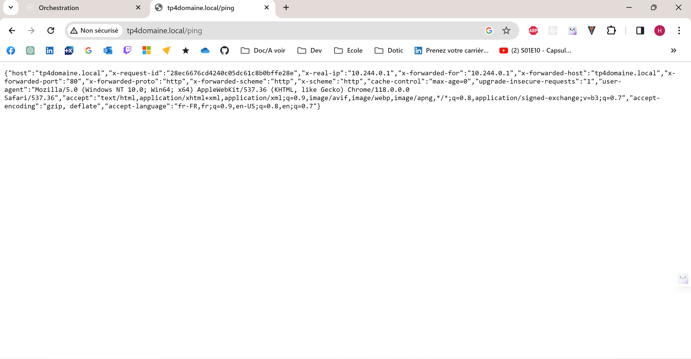

# Création et gestion de serveur Kubernetes

Prérequis : 
- Cluster Kuberctls fonctionnel
- [Kubernetes](https://kubernetes.io/docs/home/) installé

# Guide: 
Créer fichier Pod : ```echo-pod.yaml```

```bash
kubectl apply -f echo-pod.yaml
```

Configuration du port-forwarding 
```bash
kubectl port-forward echo-pod 8080:8888
```
### Mise en place du ReplicaSet

Augmente la disponibilité et la redondance de l'application, Duplique le pod
créé précédemment.

Créer fichier ReplicatSet : ```echo-replicaset.yaml```
```bash
kubectl apply -f echo-replicaset.yaml
```
### Créer un Service
Permet l'accès à l'application depuis l'exterieur du cluster.<br><br>
Créer fichier Service : ```echo-service.yaml```
```bash
kubectl apply -f echo-service.yaml
```

### Créer un déploiement

Gère plusieurs instances du pod.

Créer fichier du déploiement : ```echo-replicaset.yaml```
```bash
kubectl apply -f echo-deployment.yaml
```

Activer le pluggin minikube (solution de virtualisation légère qui permet de 
créer un cluster Kubernetes local pour le développement et les tests)

```bash
minikube addons enable ingress
```
Lancer minikube :
-  ```minikube start```
-  ```minikube tunnel``` (Expose les services Kubernetes aux app. en cours
d'exécution sur l'hôte local)

### Créer un ingress

Gère plusieurs instances du pod.

Créer fichier ingress : ```echo-ingress.yaml```

```bash
kubectl apply -f echo-ingress.yaml
```

Il est necessaire de modifier le fichier hosts ```/etc/hosts``` de notre système
pour entrer le nom de domaine utilisé dans l'Ingress. 

Il sera alors possible d'utiliser un nom de domaine local pour accéder à l'application Kubernetes, via Ingress.
